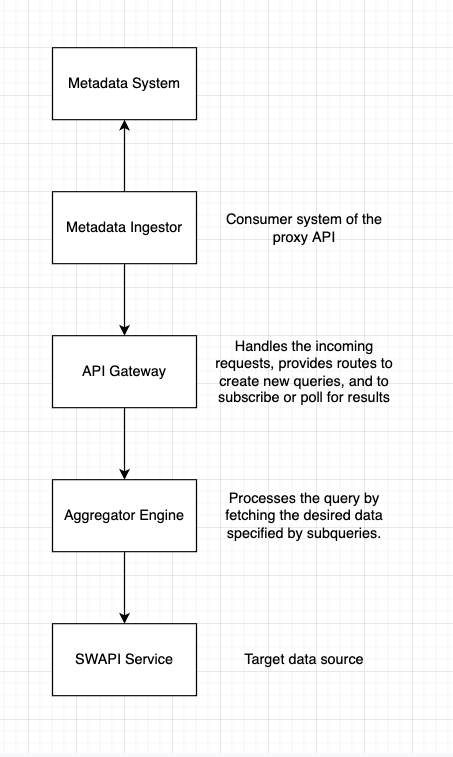
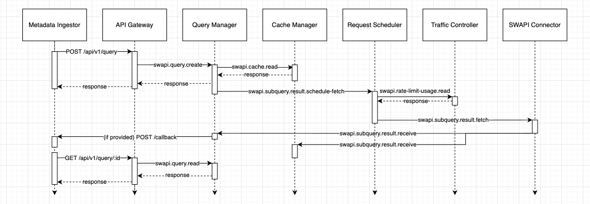
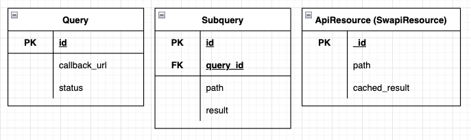

# SWAPI API Resource Aggregator Service

## Introduction

This project is an experimental project for an HTTP-based API proxy service. Its design goals include the following:
 - Provide a means to access the target service, even if constraints such as rate-limiting means that the service is unavailable.
 - A flexible system that allows RESTful API resource requests to be aggregated into a single request.
 - Can tolerate a relatively high throughput of requests, compared to synchronous-based approaches.

For the purposes of a demo, this project has been integrated with the SWAPI API service (https://swapi.dev).

The aim is to satisfy the following use cases:
1. Provide an endpoint to proxy a single call to the proxied API.
2. Provide an endpoint to aggregate multiple calls to the proxied API.
3. Dynamically schedule requests if the downstream target service has rate-limiting and the limit is reached.

## Design Approach

The time allowance for this project was approximately 1 week. Given the time constraints, TypeScript and NestJS were selected as the language and framework, to provide structured guidance in developing the project with key patterns and tools available for use. In addition, the author is currently already learning and using these tools, so this exercise was viewed as good practice.

As there is no concrete business case to optimise for, some assumptions have been made:
1. Cost optimisation can be considered out of scope, as long as within reason.
2. High throughput requirement of the system is assumed - e.g. higher than the 10K / day limit that SWAPI imposes.
3. There is a desire that once rate-limiting of the target service is reached, that requests do not begin to fail with e.g. an 429 status. Instead, the system can be designed to be event-driven and allow data requests to be scheduled in the background.
4. While the SWAPI API service itself is quite small (acoording to [their own statistics](https://swapi.dev/about), only 260 resources), for the purposes of extensibility and scalability, it is assumed that the system needs to tolerate a large number of target resources, such that they cannot all be cached for fast retrieval and to side-step the rate-limiting issue.

Fundamentally, the system that needs to be designed consists of two components:
1. An HTTP-based API gateway, to allow requests to be received and responded.
2. An aggregation logic engine, to process the requests, identify and obtain the desired data, and return it.


_1. System Overview_

Combined with the previous stated requirements and goals, the following solution architecture is proposed.

## Architecture

### Solution Architecture 


### Microservices Communication


### Database Entities


### Notes
 - We opt for a more complex Aggregation Engine to provide the following features
  1. Use a cache such that similar requests do not result in multiple calls to the downstream datasource.
  2. Auto-scheduling of requests if the downstream rate limit is reached, with support for both event-driven and poll-based retrieval.
  3. Enable extensibility by design, so that new entities or APIs in future can easily be supported with minimal changes.
 - From the API Gateway downstream, communication is via the NATS message broker. It allows for asynchronous communication between the microservices to allow for requests to be processed quickly and not wait unnecessarily. This allows for better scale.
 - If the consumer system were available to communicate through another mechanism other then HTTP, this would be more desirable. However, in the absense of this, the system can remain event-driven by allowing the consumer to specify a callback URL, such that when a requests is eventually fulfilled, the consumer system is notified via HTTP.
 - JetStream provides exactly-once message delivery guarantees to ensure requests are not lost and are fulfilled properly, without excess requests.
 - There are three key entities presents for the system
  1. Query - a consumer request for data from the target (proxied) API service, can be used to represent a single, aggregated request for data.
  2. Subquery - the resource data that is requested, one or more of which are specified in a query.
  3. ApiResource ("SwapiResource") - the SWAPI target resource data, which may be cached for further system performance.
 - The API Gateway microservice is the entry point of the system, exposing it an HTTP REST API and communicating via JSON payloads. It exposes two main routes and one debug route. There is a Swagger spec available when running the project.
 - The Query Manager microservice is the starting point of the "Aggregation Engine" for all queries. It checks if all subqueries specified are present in the cache; if so, data is immediately returned. If not, the subqueries that need to be fetched are scheduled. Queries can also be requested after being created to allow polling-style checks for data, in additional to the event-driven callback mechanism. These Queries and Subqueries are managed in a PostgreSQL database to easily manage the relationship between the data. For larger scale, sharding should be okay given the low complexity of the data and locality of the relationships, but a pure NoSQL-based implementation may be more optimal.
 - The Cache Manager microservice is responsible for checking and updating the cache when required. It uses a NoSQL document based database for extensibility for other API resources and performance. The ApiResource entities stored have a TTL to automatically manage the cache's freshness - this is currently set for 24 hrs, but could be adjusted based on business needs and cost analysis.
 - The Traffic Controller microservice tracks the rate limit consumption of the downstream service. It employs a sliding-window rate-limiting mechanism, implemented on the NoSQL key-value Redis storage system for speed and simplicity. Can easily be modified based on business requirements to another approach, such as fixed-window. It is not immediately clear from SWAPI's documentation which approach they employ, and this was not tested to mitigate risk of downtime for their service.
 - The Request Scheduler microservice manages to scheduling of jobs. It uses the BullMQ message queue system, backed by Redis, for improved reliability and assurance. The message queue will hold messages if the downstream service is down, until such time it is ready to begin processing again.
 - The SWAPI Connector microservice integrates with the demo target SWAPI service. It's job is small - to fetch data from the target downstream service and publish it for the other microservices to consume.

## TODOs / other remarks

 - Due to time constraints, the following key functionality and activities have not yet been completed
  - JetStream delivery guarantees
  - API error handling and full input sanitisation.
  - Performance testing - ideally with something like JMeter to observe how well the system handles throughput and baseline latency. Observations during exploratory testing revealed requests to average approx 20 - 150ms for low throughput.
  - App containerisation (currently, only backend resources - databases / NATS - are set up via Docker Compose)
 - Multiple databases have been used for additional isolation, and for the author's own learning; in a production scenario, careful analysis is required to understand business requirements and understand cost implications.
 - This system was built with a few guiding assumptions; in a production environment, additional considerations are required on business need and value to justify this system design. This includes perhaps picking a technology and framework higher on the [TechEmpower rankings](https://www.techempower.com/benchmarks/#section=data-r22&hw=ph&test=fortune) (currently NestJS + TypeScript are rank 106 / 13.6%, whereas ASP.NET is #15 at 76% of max observed performance)

## Installation

### Prerequisites
1. Node v22 (use NVM if needed): https://github.com/nvm-sh/nvm
2. Docker

### Steps
```bash
$ yarn install
```

Note: as this is an experimental project with all dependencies self-contained, the `.env` configuration files have been checked into the repository for ease of setup. Do NOT use in production, and be wary of making edits to the repository and accidentally publishing any secrets.

## Running the project
```bash
$ yarn compose-build
$ yarn start:all
```

Then, navigate to `http://localhost:3000` to view the service Swagger docs!

## Test

```bash
# unit tests
$ yarn run test

# test coverage
$ yarn run test:cov
```

## Stay in touch

- Author - [Jason Pan](https://github.com/jasonpan)
